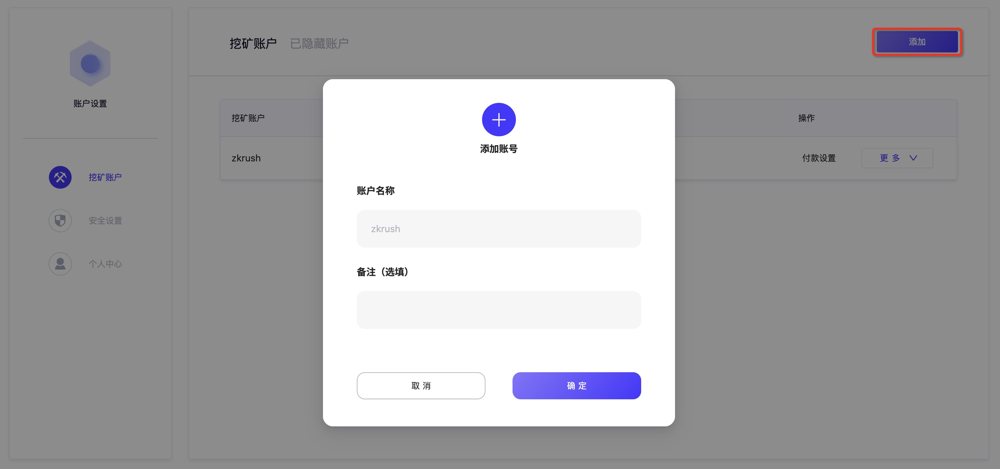

# ALEO测试网挖矿教程

## 矿池节点地址

stratum+tcp://aleo.zkrush.com:3030


## 一、创建挖矿账号

1、主账号**登录**->右上角头像进入**账户设置**

2、**添加**挖矿账户




## 二、获取挖矿客户端

 1、客户端下载地址:https://github.com/AleoHQ/aleo


## 三、启动挖矿客户端

### CLI启动方式

```shell
aleo-pool-client --dest=47.241.247.18:3030 run --miner-account testaccount001 --owner-name testserver001

--dest					#矿池地址
--miner-account #挖矿账号
--owner-name 		#主机名，默认为default
```


### GUI启动方式

【保留】


