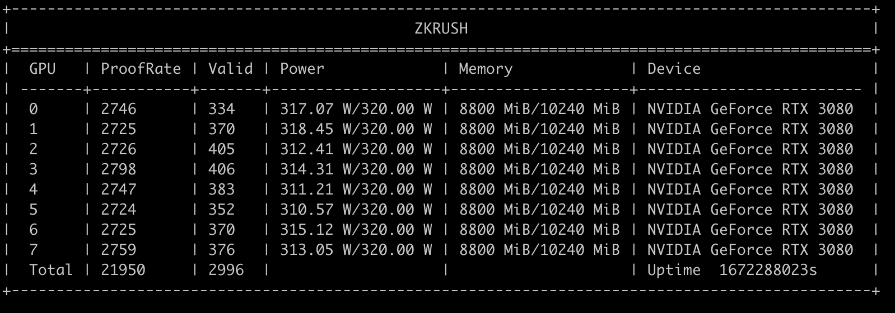

# ALEO測試網挖礦教程

## 支持設備

操作系統：Ubuntu 20.04

GPU：所有N卡都可以使用，推荐6G以上显存，显卡驱动515或以上。

驱动下载：https://www.nvidia.cn/Download/index.aspx?lang=cn


## 礦池節點地址

tcp://aleo.zkrush.com:3333


## 1、添加挖礦賬號

1.1、參考文檔 [添加挖礦賬號](/_document/miner_account?id=添加挖礦賬號)


## 2、獲取挖礦客戶端

 2.1、客戶端下載地址: https://github.com/zkrush/aleo-pool-client/releases

> ***aleo-pool-prover是ZKRush自研發的aleo挖礦程序，纯GPU方案，对CPU无要求***


## 3、啟動挖礦客戶端

將客戶端拷貝到礦機上，執行如下命令，賦予程序執行權限

```shell
chmod +x aleo-pool-prover
```

將下方命令中的account為你的挖礦賬號，machine-name替換為你的機器名。執行拉起

```shell
nohup ./aleo-pool-prover --dest tcp://aleo.zkrush.com:3333 --account account --machine-name machine-name &> prover.log &
```

**啟動參數说明：**

--dest #礦池節點地址

--account #挖礦賬號，创建请參考文檔 [添加挖礦賬號](/_document/miner_account?id=添加挖礦賬號)

--machine-name #主機名

程序自動初始化並拉起礦機上的所有GPU卡

檢查prover.log日誌，有如下信息，則說明程序運行正常。




