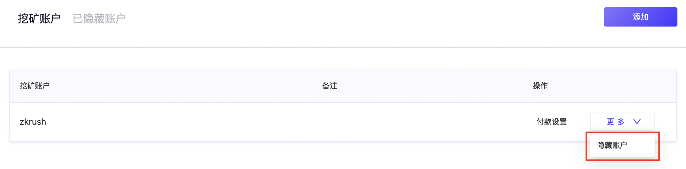
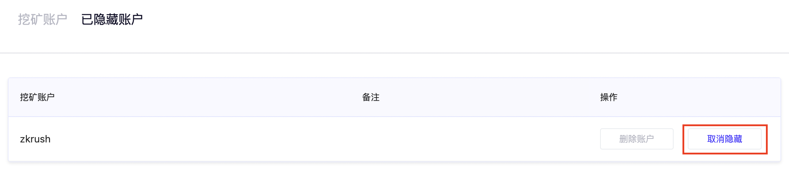
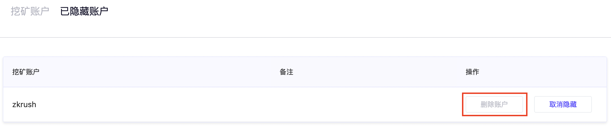

# 添加/隐藏/删除挖矿账号

在[ZKRush](https://www.zkrush.com)官网登录**主账号**后，点击右上角头像进入**账户设置**

## 添加挖矿账号

1、**账户设置**页面点击**添加挖矿账号**

> *挖矿账号全站唯一*
>
> *命名规则：2-15个小写字母或数字，且不能以数字开头*
>
> *可以添加并修改账号备注*

## 隐藏挖矿账号

1、**账户设置**页面，选择**更多**，点击**隐藏账户**

2、在**已隐藏账户**中，点击**取消隐藏**，即可恢复隐藏账户

## 删除挖矿账号

1、**账户设置**页面，在**已隐藏账户**下，点击**删除账户**，即可删除该挖矿账号

> *需要将挖矿账号隐藏后，才能进行删除操作*
>
> *⚠️ 挖矿账号删除后无法恢复，对应记录也会被删除；删除的挖矿账号无法被再次注册，请谨慎操作；*

