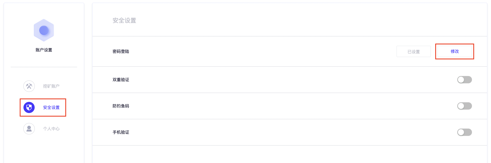
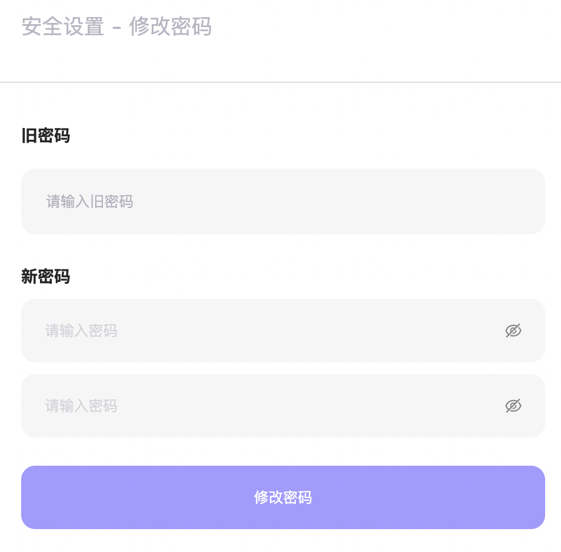

# 修改/忘记密码

## 修改密码

1、在[ZKRush](https://www.zkrush.com)官网登录**主账号**后，点击右上角头像进入**账户设置**

2、进入**账户设置**页面，选择**安全设置**

3、选择**密码登录**右侧的修改

4、按照提示，输入老密码、新密码、确认密码，点击**修改密码**

> ⚠️如您开启双重验证或手机验证，根据后续提示输入您的验证码后完成操作。

## 忘记密码

1、

