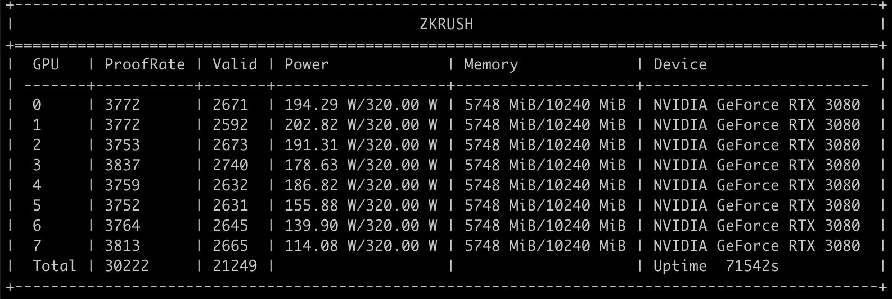

# ALEO Testnet

## Minimum Requirements

Operating System: Ubuntu 20.04

GPU: All Nvidia series, 6GB, driver version 515 or above.

Download driver:https://www.nvidia.cn/Download/index.aspx?lang=en


## Mining Pool URL

tcp://aleo.zkrush.com:3333


## 1. Add Mining Account

1.1.Please refer to  [Add Mining Account](/en/_document/miner_account?id=add-mining-account)


## 2. Install Mining Client

 2.1.Download Address: https://github.com/zkrush/aleo-pool-client/releases

> ***aleo-pool-prover is a mining program developed by ZKRush, Pure GPU solution, no CPU requirement***


## 3. Start Mining Client

Copy the client and then paste it to your mining devices, execute the command to grant permission

```shell
chmod +x aleo-pool-prover
```

Replace 'account' in the following command with your 'mining account', and replace 'machine-name' with your 'device name'

```shell
nohup ./aleo-pool-prover --dest tcp://aleo.zkrush.com:3333 --account account --machine-name machine-name &> prover.log &
```

**Startup Parameters Explained：**

--dest #Mining Pool URL

--account #Mining Account

--machine-name #Device Name

The program will automatically initialize and run all GPUs.

Check prover.log, if it matches the info given below, then the program is running properly.




